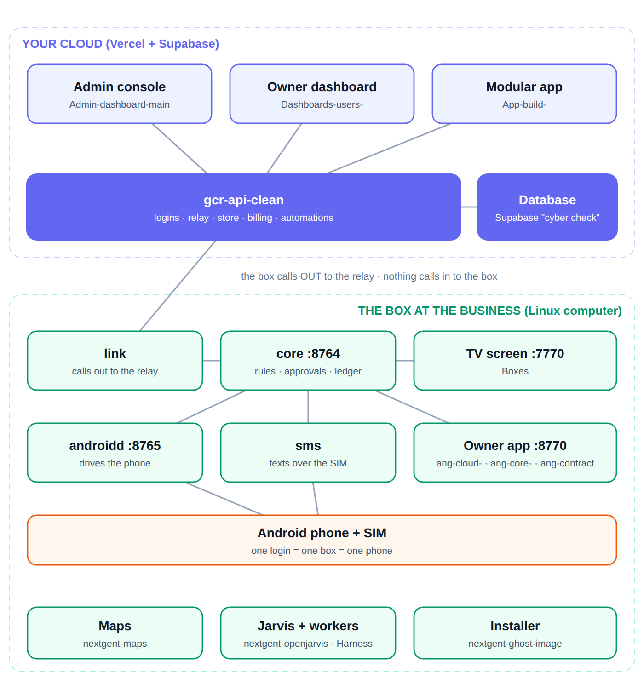

# gcr-api-clean

**The one backend.** Every screen, every app and every AI agent talks to this
API, and **only this API talks to the database** (Supabase project `cyber check`,
see `CLAUDE.md`). No dashboard and no MCP server holds a database key. Production:
`gcr-api-clean.vercel.app` (Express on Vercel).

It started as the Gulf Coast Radar directory backend and now also carries the
Ghost product: the relay to each box, the fleet view, the App Store, billing and
the automation builder. Those Ghost parts sit in the same service and the same
database as the directory.

**In the Ghost system this is the cloud API.** A Ghost box is a Linux computer at
a business running the blocks installed by `nextgent-ghost-image`. The cloud side
is this API plus its callers: the operator console (`Admin-dashboard-main`) and
the business-owner dashboard (`Dashboards-users-`). A box never receives inbound
calls; it polls `routes/nodes.js` (heartbeat, pull, respond).




<!-- branches:start -->
## Branches

*Read from GitHub on 2026-09-29. 53 branches.*

- **Default branch on GitHub:** `main`. It does **not** yet have this README or the audit fixes; those are on `claude/repo-code-analysis-y4n1k7`, which contains every commit of `main` and more, so it can be fast-forwarded without losing anything.
- **`claude/repo-code-analysis-y4n1k7`** is where the README audit, the screenshots and the fixes were made.
- **42 other branches hold commits that `claude/repo-code-analysis-y4n1k7` does not have.** The newest is `claude/linux-build-cleanup-dfpu0e` (last commit 2026-09-15, 1 commit not in the work branch). Check those before assuming the work branch is the whole story.

<details><summary>All 53 branches</summary>

| Branch | Last commit | Not in the work branch | Last commit message |
| --- | --- | --- | --- |
| `claude/repo-code-analysis-y4n1k7` (work branch) | 2026-09-29 | - | this README and the audit fixes |
| `claude/linux-build-cleanup-dfpu0e` | 2026-09-15 | 1 | docs: README — this repo's own CLAUDE.md already has the real rules |
| `claude/modular-booking-platform-wdq0kk` | 2026-09-13 | 6 | Prove the modularity claim with an invented vertical, and fix the prefli |
| `claude/admin-dashboard-automation-builder-s0j5ht` | 2026-09-13 | 0 | Add the automation builder: engine, routes, tables, tests |
| `claude/admin-dashboard-repo-review-47q2vc` | 2026-09-13 | 3 | Serve the feed the columns an authored post is made of |
| `claude/review-codebase-zips-hck9hd` | 2026-08-28 | 0 | Billing, ported from Huly, with the plan table taken out of the code |
| `claude/new-session-66c2e9` | 2026-08-26 | 3 | revert(devices): Take the device layer back out of this API |
| `claude/user-dashboard-credit-accounts-qjbqsl` | 2026-08-24 | 6 | Record a9gent/mindfs as prior art, and close the harness-roster question |
| `claude/repo-inventory-audit-5zw4yw` | 2026-08-13 | 5 | Add one document tying the vision, the repo audit, and the session's com |
| `claude/gcr-api-review-o45xml` | 2026-08-09 | 1 | Close a public read of customer bookings, and mount email-parser once |
| `claude/gcr-api-claim-docs-g4e42t` | 2026-08-05 | 8 | Retract 6.9 — the sign-up queue does have a screen |
| `claude/gcr-unified-loading-au5vrz` | 2026-08-04 | 1 | Give the public MCP door a kill switch, and stop an outage reading as em |
| `main` (default) | 2026-08-04 | 0 | Stop the runaway image-liveness cron from the one path still answering |
| `claude/new-session-1e1dj0` | 2026-08-04 | 20 | Fix the ceiling that would have throttled every conversation at once |
| `claude/platform-integration-launch-test-abi95i` | 2026-08-04 | 0 | Add a script that says which database the API is actually talking to |
| `claude/tourist-dashboard-layout-hi2yxu` | 2026-08-04 | 2 | Add a checker that records which images actually load |
| `claude/dashboard-inventory-purposes-m5wtba` | 2026-08-04 | 0 | Extend the service area to the whole Florida shoreline |
| `claude/gcr-unified-listing-layouts-fmjr7q` | 2026-08-04 | 4 | Give the artist page the shows it already had |
| `claude/cybercheck-modular-react-dashboard-7on41c` | 2026-08-03 | 0 | Text the dashboard: ask a question, get an answer from real data |
| `claude/booking-aggregator-platform-llup2x` | 2026-08-02 | 2 | Complete the modular booking platform: spine + all six verticals |
| `claude/synd-blue-notification-code-hqsgx4` | 2026-08-02 | 2 | Make parser actions explicit per rule |
| `claude/cybercheck-qr-redirects-a085rf` | 2026-08-02 | 0 | Serve QR scans as a real 302 instead of a client-side JS hop |
| `claude/booking-platforms-location-ie8zg9` | 2026-07-27 | 1 | Add full technical audit notes (routes, bugs, security, feature matrix) |
| `claude/gcr-api-sms-functionality-5r2zb5` | 2026-07-26 | 7 | Add read-only reconciliation report across all 5 legacy Supabase project |
| `claude/image-upload-batch-pdsr4c` | 2026-07-26 | 2 | Make booking atomic in the live engine |
| `claude/cybercheck-twilio-hardcoding-pj7eyo` | 2026-07-26 | 0 | Point invite/reset links at GCR unified, not the legacy Trip Swipe app |
| `claude/business-data-url-validation-p4l9x8` | 2026-07-26 | 3 | Wire drink item modifiers/sizing into the API (public, admin, menu-edito |
| `claude/photo-migration-queue-resume-6dkij9` | 2026-07-26 | 2 | Add edge function that copies legacy photos into production storage |
| `claude/twilio-verification-sid-506poy` | 2026-07-26 | 0 | Clean up debugging aids now that phone OTP is confirmed working |
| `claude/reset-cybercheck-admin-login-9dxuw9` | 2026-07-25 | 0 | Add missing admin routes for App Manager and Raw Data Paste features |
| `claude/gcr-unified-integration-6cghed` | 2026-07-25 | 289 | Blend fuzzy name matching into search ranking, add autocomplete endpoint |
| `claude/repo-review-image-check-lje1gv` | 2026-07-25 | 289 | Fall back to any available photo when hero_image_url is missing or broke |
| `claude/cybercheck-lead-form-integration-nkovqk` | 2026-07-24 | 291 | Default NFC card lead owner alerts to info@cybercheckinc.com |
| `temporary-cybercheck-export-20260724` | 2026-07-21 | 288 | Generalize the photo rehost tool to every external host, not just Google |
| `claude/session-lvki6x` | 2026-07-21 | 286 | Menu sections carry structured schedule fields in the entity payload |
| `claude/new-session-na3vlg` | 2026-07-21 | 285 | Fix five confirmed bugs found in tonight's full-codebase read |
| `claude/universal-booking-platform-t3zdhu` | 2026-07-20 | 281 | Fix AI concierge reading zero pricing/whats_included due to non-existent |
| `claude/database-repo-restructure-fyz0dx` | 2026-07-17 | 280 | Fix meeting_points query: alias latitude/longitude to lat/lng |
| `feature/universal-entity-graph` | 2026-07-15 | 265 | Start live database and code audit record |
| `claude/data-structure-impl-sg0g6w` | 2026-07-12 | 263 | Fix two pre-existing bugs blocking /api/public/menu entirely |
| `claude/web-scraper-en11yf` | 2026-07-10 | 238 | Add Yelp Orange Beach scraper with full business-detail phase |
| `claude/trip-swipe-bug-tcue5d` | 2026-07-09 | 239 | feat: include gcr_deals in buildFullEntity response |
| `claude/gcr-unified-dashboard-sgmaeh` | 2026-07-09 | 242 | platform.js ownership resolves through the shared entity resolver |
| `claude/open-all-757nqr` | 2026-07-08 | 234 | Merge branch 'claude/data-structure-assessment-80j1gq' into main |
| `claude/data-structure-assessment-80j1gq` | 2026-07-08 | 231 | Fix broken self-signup, add menu-editor dashboard bridge |
| `claude/fishing-charter-booking-block-qy3l1o` | 2026-07-07 | 219 | Richer marina facts; offering images in payload |
| `claude/gcr-listing-data-sources-0w1qb2` | 2026-07-07 | 210 | Populate AI-facing fields in Wharf import, normalize tag taxonomy |
| `claude/project-additions-ho3s7k` | 2026-07-06 | 186 | Fix broken returning-tourist sign-in: getUserByEmail doesn't exist |
| `claude/supabase-images-gcr-urls-hzxqzl` | 2026-07-04 | 175 | Detect payment source from body text too, not just From header |
| `claude/repo-overview-i1n9da` | 2026-07-03 | 171 | Honor seq_from/seq_to/limit on GET /api/qr for print-sheet + batch views |
| `claude/gcr-unified-api-clean-xr4029` | 2026-07-02 | 118 | Universal AI context + public.js wiring (read-path, additive) |
| `claude/gcr-unified-data-gaps-xxyarl` | 2026-07-02 | 166 | Await taxonomy-backed category lookups, add GET /api/gcr/taxonomy |
| `Test` | 2026-06-27 | 119 | fix: entity_events joins artist table — artist_slug, artist_image, artis |

</details>

<!-- branches:end -->

## Who it serves

| Caller | Mount | Auth |
| --- | --- | --- |
| Admin console (`Admin-dashboard-main`) | `/api/admin/*` | admin JWT from `POST /api/admin/login` (`adminRequired`; `routes/admin.js` carries its own copy of the check, which also accepts the `ADMIN_SECRET` key) |
| Business dashboard (`Dashboards-users-`) and Modular app | `/api/business/*`, `/api/store`, `/api/nodes`, `/api/billing` | business session (`ownerRequired`) |
| Business sign-up and sign-in | `/api/business-auth` | phone number plus our own phone code (`lib/phoneVerification.js`, any carrier); the session is minted by the API |
| Older dashboards and owner sites (the `site_id` model) | `/api/dashboard`, `/api/site`, `/api/auth`, `/api/user`, `/api/stripe`, `/api/square`, `/api/qr`, owner side of `/api/platform` | legacy JWT (`authRequired`): the business is the `site_id` in the token, not an `entity_slug` |
| A Ghost box | `/api/nodes/heartbeat`, `/pull`, `/requests/:rid/response` | a node token (only its hash is stored) |
| AI agents | `/api/mcp` (read and edit one business) | business MCP token (`gcr_mcp_…`) or a business dashboard session |
| AI agents, public | `/api/mcp/public`, `/api/mcp/business/:slug` (read-only) | none; a tourist token or guest id is optional and only adds memory. `/api/mcp/business/:slug` names its business in the URL and serves public data only |
| Public sites (`gcr-unified`) | `/api/gcr`, `/api/public`, `/api/tourist*` … | none / tourist session |
| Inbound webhooks | `/api/webhooks` (`/stripe`, `/twilio` for STOP handling, `/email`; `/google` is a stub), `/api/meta-webhook`, `/api/email-parser/inbound`, `/api/dashboard-sms/inbound`, `/api/integrations/fareharbor`, `/api/transportation`, `/api/intake` | each source's own secret or signature; several of those checks apply only when the secret is configured |

`server.js` has 79 `mount()` calls over 71 router files (some files are mounted
more than once: `email-parser`, `update-link`, `intake`, `automations`, `store`,
`composio`, `mcp-public`). Eight more mounts are commented out, with the reason
beside each (`apps`, `modules`, `boat-rental`, `charter`, `rides`, `photographer`,
`messaging`, `whatsapp`). A router that fails to load is skipped with a warning
instead of crashing the API, and `GET /` reports the commit and the mounted paths.

## Two rules

**The slug is never taken from the request** on the routes behind `ownerRequired`.
`middleware/ownerAuth.js` resolves which business a caller is from the session
token via `entity_owners`, and handlers filter on `req.entitySlug`, never on the
URL, query or body. The one exception is an admin, who must name a slug
explicitly and is checked against `platform_admins` first. Same for `/api/mcp`:
which business a token acts as comes from `business_mcp_tokens`, and none of its
seven tools takes a slug argument. This is the rule for anything that reads or
writes as a business through the routes listed above.
Public read routes (for example `GET /api/faqs/:slug` in `routes/faqs.js`, and the
open `/api/mcp/public` and `/api/mcp/business/:slug` servers) serve public data
and do take the slug from the URL or tool arguments. The older code listed under
[Outside the rule](#outside-the-rule) predates it.

**One copy of the guards.** `lib/businessTables.js` holds schema discovery, the
table allow-list and the column filter. `routes/business-data.js` and
`routes/mcp.js` both use it. Tables that carry `entity_slug` but must never be
written by a business (`billing_subscription`, `store_installs`, `store_grants`,
`entity_automations`…) are held back there.

## The Ghost parts

| Piece | Where | Tables (SQL) |
| --- | --- | --- |
| **Relay** to each box: an owner enrols a box, sends it a request, reads the answer. The box calls out, nothing calls in. One login = one box. | `routes/nodes.js` | `ghost_nodes`, `ghost_node_requests` (`sql/ghost_nodes.sql`) |
| **Fleet view** (read-only): every box, its release, online or not | `routes/admin-ghost.js` | same |
| **App Store**: items, versions, plans, grants, deployments, installs; entitlement is free OR plan OR grant; a version that widens access is offered, never forced | `routes/store.js`, `lib/entitlements.js`, `lib/storeManifest.js`, `lib/audience.js` | `store_*` (`sql/store.sql`) |
| **Billing**: plans and limits are rows, grace period before restriction | `routes/billing.js`, `lib/billing.js` | `billing_*` (`sql/billing.sql`) |
| **Automation builder** | `routes/automations.js`, `lib/automationEngine.js` | `sql/automations.sql` |

The store and billing tables are applied to the live database, and were checked
there on 2026-09-29: row-level security on, nothing granted to `anon` or
`authenticated`. The relay and automation tables were applied earlier; the
automation SQL enables row-level security and revokes `anon`/`authenticated`
grants, and the relay SQL (`sql/ghost_nodes.sql`) enables row-level security
without an explicit `revoke`, but that was not re-checked on the live database.

## Everything else in this service

Most of the code is the older Gulf Coast Radar directory and booking platform,
which the Ghost parts sit beside. Each row was read in the named file.

| Area | What it does | Where |
| --- | --- | --- |
| **Public directory** | The read model behind the public site: full business build, paginated and searched lists, suggest, taxonomy, page rails, ads, "live now", home feed, date-range availability search, click and page-view tracking, business claims, NFC-card leads | `routes/gcr.js`, `routes/embed.js` (availability calendar for a business's own site, cached 5 min) |
| **Legacy storefront** | The `site_id` public API: profile, fleet, availability with 10-minute holds, bookings via atomic RPCs, waivers, reviews by token, loyalty points, orders, contact form, AI chat (Grok for tourists, OpenAI for a business page) | `routes/public.js` |
| **Admin data tools** | Entity CRUD and bulk PATCH, CSV and JSON importers (matched by name and address, then phone), photo upload with AI vision tagging, page rails, ads, coupons, AI provider config, invites and owner linking, SMS blasts to opted-in tourists | `routes/admin.js`, `routes/admin-settings.js`, `routes/admin-signups.js`, `routes/admin-analytics.js`, `routes/admin-tourists.js` |
| **AI-assisted editing (admin)** | `POST /api/admin/gcr/ingest/:slug/:table` proposes rows from up to 8 URLs using the live table schema and writes nothing; `GET /api/admin/gcr/profile/:slug` reads every slug-keyed table for one business | `routes/ingest.js`, `routes/business-profile.js` |
| **Booking platform** | One universal booking engine: offerings, public page and booking, HMAC-signed manage links, waivers, reminder cron, promo codes, tourist wallet and rewards, availability engine; admin oversight (58 admin routes) | `routes/platform.js`, `routes/admin-platform.js`, `routes/availability.js`, `routes/availability-engine.js` |
| **Booking ingestion** | Forward a confirmation to `gcr-<slug>@parse.gulfcoastradar.com` and it is parsed (24 extractors: FareHarbor, Peek, Viator, Airbnb, VRBO, OpenTable, Square, Calendly and others) into capacity; iCal import on an hourly cron; Instagram and Facebook webhook for posts, photos and hours; FareHarbor API sync; an inbound-email webhook that recognises the sender (Venmo, Cash App, Airbnb, VRBO, Booking.com, Toast) and parses Venmo and Cash App receipts (`extractors/`) | `routes/email-parser.js`, `routes/email-webhook.js`, `routes/meta-webhook.js`, `routes/fareharbor.js`, `extractors/` |
| **Payments** | Stripe (Connect and a business's own encrypted key) and Square (encrypted token) | `routes/stripe.js`, `routes/square.js` |
| **Trip Swipe (tourists)** | Email, phone-code, Firebase and magic-link sign-in; swipes, saves, preference scores, itineraries, groups, points and rewards, an AI concierge, geofence SMS | `routes/tourist.js`, `routes/tourist-auth.js`, `routes/tourist-groups.js` |
| **Business sign-up** | Phone sign-up creates the listing inactive, an `entity_owners` row and a pending `business_signups` row with possible duplicates; an admin approves | `routes/business-auth.js`, `routes/admin-signups.js` |
| **Owner tools** | Owner AI assistant with tool use (edits menu, specials, events, hours, profile, tags, FAQs, photos; remembers facts), "text your dashboard" by SMS (allow-listed numbers, read-only tools, replies capped at 300 characters), Google Business Profile OAuth, QR codes with scan logging and referral partners, AR scavenger hunts (server-side distance check), voice notes, links pages | `routes/dashboard.js`, `routes/dashboard-sms.js`, `routes/google-business.js`, `routes/qr.js`, `routes/ar-hunts.js`, `routes/voice-notes.js`, `routes/links.js` |
| **Menu editors** | PIN-based menu editor, per-link daily update pages, simple menu edit | `routes/menu-editor.js`, `routes/update-link.js`, `routes/simple-menu-edit.js` |
| **Transport** | SMS-brokered dispatch to a provider with a 5-minute expiry cron and a 10% platform cut | `routes/transportation.js` |
| **Importers and crawlers** | Deep-crawl importer with a 30-minute cron, photo rehosting, OCR, DNS verification | `routes/gcr/deep-crawl.js`, `routes/rehost-photos.js`, `routes/ocr.js`, `routes/verify-dns.js` |
| **Intake, App Store catalogue** | Signed intake webhook and admin queue; Composio tool catalogue and per-business connections | `routes/intake.js`, `routes/composio.js` |

`vercel.json` schedules five crons: `/api/platform/cron/reminders` (hourly),
`/api/gcr/deep-crawl/run` (every 30 minutes), `/api/email-parser/ical-import/run`
(hourly), `/api/transportation/expire` (every 5 minutes) and
`/api/automations/cron/tick` (hourly).

## Outside the rule

The rule above covers `routes/store.js`, `nodes.js`, `billing.js`,
`business-data.js`, `mcp.js`, the owner side of `automations.js` and
`composio.js`, `google-business.js`, the business half of `transportation.js`
and the other `ownerRequired` routes. Older code predates it, and works another
way:

- **`site_id` routes** take the business from the legacy JWT: the legacy half of
  `routes/dashboard.js` (bookings, customers, fleet, pricing, coupons, loyalty,
  SMS campaigns, media and more), `routes/site.js`, `routes/rentals.js`,
  `routes/services.js`, `routes/stripe.js`, `routes/square.js`. In `routes/dashboard.js` the GCR-native sections (profile,
  hours, gallery, FAQs, team, events, specials, menu items, theme, units,
  iCal) find the listing through `lib/entity-resolver.js` instead.
- **Routes where the caller supplies the business or id** and the route does not
  tie it to the session: `/api/ar-hunts` (any signed-in user), `PATCH
  /api/artists/:slug`, `POST /api/dashboard/menu/generate-design` (`site_id`
  in the body), `GET /api/analytics/stats` (`site_id` in the query),
  `/api/menu-edit` (a fixed passcode), `/api/qr/partners*`,
  `PUT`/`DELETE /api/live-photo`, `POST /api/deals/activate/:id` and
  `GET`/`PUT`/`DELETE /api/bookings/:slug/:id` (all need a session but do not
  check the row or slug belongs to the caller).
- **`/api/email-parser`**: only `/inbound` is meant to be public; `/manual`,
  `/bulk-import`, `/setup/:slug`, `/log` and `/ical-import/sync-now/:id` have no
  session check (see `HANDOFF.md` §5.2).
- **`/api/menu-editor` and `/api/update`** use a per-business PIN or a per-link
  passcode instead of a session.
- **Public routes that write** take the business from the URL or body and need
  no session: the `/api/public` waiver, booking, review and contact routes,
  `/api/gcr/opt-in`, `/api/gcr/waiver/:slug/sign`, `/api/gcr/track` and
  `/api/gcr/claim`.

## Run it

```bash
npm install
npm run dev        # node --watch server.js
npm start
```

Configuration is environment variables (names only here): `GCR_SUPABASE_URL`,
`GCR_SUPABASE_SERVICE_KEY`, `JWT_SECRET`, `CRON_SECRET`, `CORS_ORIGINS`,
`ANTHROPIC_API_KEY`, `COMPOSIO_API_KEY`, `BREVO_API_KEY`, plus the rest in
`.env.example`.

- `db.js` exits the process at start without `GCR_SUPABASE_URL` and
  `GCR_SUPABASE_SERVICE_KEY` (it also accepts `SUPABASE_URL` / `SUPABASE_KEY`).
- `routes/admin.js` throws at load without `JWT_SECRET`; `server.js` then skips
  that router, so `/api/admin/login` would not exist.
- `PUBLIC_MCP_RATE_LIMIT` (default 600 a minute, per credential or IP) limits
  `/api/mcp/public` and `/api/mcp/business/*`. `PUBLIC_MCP_HIDE_PERSONAL=true`
  makes those two servers hold back tables and columns that describe people; it
  is off by default (`lib/businessTables.js`).
- `.env.example` lists `FROM_EMAIL`, `FROM_NAME`, `APP_URL` and `API_BASE_URL`,
  which no route reads. `utils/email.js` reads `BREVO_API_KEY` and `EMAIL_FROM`
  (default `info@cybercheckinc.com`).
- `npm run vercel-build` runs `scripts/stop-image-cron.mjs` on every Vercel
  build. It calls the `exec_sql` RPC with the service key to unschedule the
  `image-liveness` pg_cron job and, if that works, deletes the rows in
  `net._http_response` and `public.image_probe`. It never fails the build.

## The always-on server (live calls and texts)

Most of this API runs on Vercel. **Live calls and texts do not, and must not**:
`POST /api/telephony/telnyx/voice` and `/messaging` (`routes/telephony-live.js`)
acknowledge each Telnyx webhook and then keep working — a call is minutes of
webhooks, LiteLLM turns and MCP tool calls, and a serverless function is frozen
the moment it has answered. Run the same `server.js` on an always-on host
(`npm start`) and point the Telnyx messaging profile and Call Control
connection there:

- `<always-on host>/api/telephony/telnyx/messaging` — inbound texts
- `<always-on host>/api/telephony/telnyx/voice` — inbound calls (answer, speak,
  listen with speech transcription, answer through LiteLLM, loop)

Who answers is the number called: `CONCIERGE_NUMBER` is the concierge (public
MCP tools, NEXT GENT's instructions and LiteLLM key); a Phone Agent number is
that business (its install's permissions over the business MCP tools, the
agent's stored instructions, the company's LiteLLM key). Each conversation is
recorded to Paperclip (`POST /api/nextgent/conversations`, signed).

Set `ALWAYS_ON=true` there: `lib/scheduler.js` then runs the scheduled work
in-process every minute (automations, waits and completed bookings, Google
pushes, closing quiet text conversations, LiteLLM spend), which on Vercel runs
from `vercel.json` crons at coarser intervals.

## Checks

```bash
npm run verify     # sql safety, capability columns, and every suite below
npm run test:mcp   # MCP protocol and scoping
npm run test:nodes # relay
npm run test:ghost-admin
npm run test:automations
npm run test:billing
npm run test:store # 49 checks against an in-memory database
npm run test:concierge
npm run test:leftovers         # forwarding address, phone codes, platform texts, computers
npm run test:messages          # messages.send: MCP tool, owner screen, consent, registered numbers
npm run test:automation-steps  # wait, agent, message; booking/payment/review events
npm run test:intake            # forwarding codes, unknown senders, payments, /api/owner
npm run test:owner-app         # builder palette and drafts, checkout, pairing, remote view
npm run test:receipts          # Ghost receipts to Paperclip
npm run test:google-push       # Google push queue, edit limit, read-back
npm run test:phone-agent       # number bought, billed, released; forwarding codes
npm run test:live              # Telnyx webhooks, routing, LiteLLM with MCP tools
npm run test:litellm-usage     # spend pulled per company
npm run test:email             # platform emails from template files
npm run test:dedup             # one copy each: access, installs, prices, codes, consent, sends, messages
```

None of them needs credentials or a network.

## Automation builder

Build a trigger + a chain of steps once in the admin console, publish it as a
version, and push that version to every business dashboard (or some). A
business runs the version it was given, never the draft — so editing changes
nothing anywhere until the next publish and push.

| Piece | Where |
|---|---|
| Engine: step catalogue, templating, runner, schedule check, events | `lib/automationEngine.js` |
| Routes: admin builder, owner installs, cron tick, inbound hooks | `routes/automations.js` |
| Installing on a business (store installs and admin rollouts, one path) | `lib/automationInstalls.js` |
| Tables (applied to the live project) | `sql/automations.sql` |
| Tests, no credentials needed | `npm run test:automations` |

Mounts: `/api/admin/automations` (adminRequired), `/api/business/automations`
(ownerRequired — the slug comes from the session), `/api/automations/cron/tick`
(hourly, from `vercel.json`, guarded by `CRON_SECRET` when that is set) and
`/api/automations/hook/:token` (one random token per install).

How an automation reaches a business: the owner installs it from the
Paperclip store (`POST /api/nextgent/installs`, kind `automation`, item key =
the automation's `key`), which is the release path; the builder's
`/api/admin/automations/:id/deploy` stays for authoring and staged rollouts of
a version. Both run `installAutomation` in `lib/automationInstalls.js`.

Step types are the modular part: `data.query`, `data.insert`, `data.update`,
`condition`, `transform`, `script`, `ai.prompt`, `http.request`, `sms.send`
(the business's own numbers only), `message` (a customer, with consent),
`email.send`, `wait`, `agent`, `notify`, `log`. Adding one is one entry in the engine; the admin
console's builder reads the catalogue from `GET /api/admin/automations/meta`.

The data steps use the same three guards as the dashboard and the MCP server
(`lib/businessTables.js`). `entity_automations` and `automation_runs` carry
`entity_slug` but are held back from schema discovery there, so a business can
never reach them through the generic writer.

To fire an automation from another route: `require('../lib/automationEngine').emitEvent(name, slug, payload)`.
`routes/intake.js` does this for `intake.created`.

## Deprecated, kept until their data moves

| Route | Replaced by | Retire when |
|---|---|---|
| `GET/POST /api/admin/apps`, `PUT/DELETE /api/admin/apps/:appId` (the `apps` catalog, Plat-admin's App Manager) | the Paperclip store catalog | the `apps` rows are published as store items |
| `POST/DELETE /api/admin/site-apps` (`site_apps`, installing an app for a business) | `POST /api/nextgent/installs` / `DELETE /api/nextgent/installs/:installId` | the `site_apps` rows are installs in the store |

Both answer with `Deprecation: true` and a `Warning` header. Plan section 7
("Eight stores in code today, one kept") has the full table.

## Other documents in this repo

- `CLAUDE.md`: which database, and the two architecture rules. Its "27 checks"
  for `test:mcp` is out of date; the suite prints 80.
- `MCP_SETUP.md`: how to connect an AI to the three MCP servers. Current apart
  from two numbers: the public rate limit defaults to 600 a minute (not 120) and
  `test:mcp` runs 80 checks (not 78).
- `HANDOFF.md`: history of applying SQL to the wrong Supabase project. It
  describes the `sql/` folder as it was then (eight files); the folder now holds
  16, of which eight still carry the DO NOT RUN banner. `npm run smoke`, which it
  mentions, does not exist.
- `EMAIL_SETUP.md`: out of date. `sendVerificationEmail` and
  `sendPasswordResetEmail` do not exist in `utils/email.js`, and the variables it
  tells you to set (`FROM_EMAIL`, `FROM_NAME`, `APP_URL`) are not read.
- `ADMIN_SETUP.md`: creating an admin with `scripts/create-admin.js`. Its
  troubleshooting line that login works without `JWT_SECRET` is wrong (see above).
